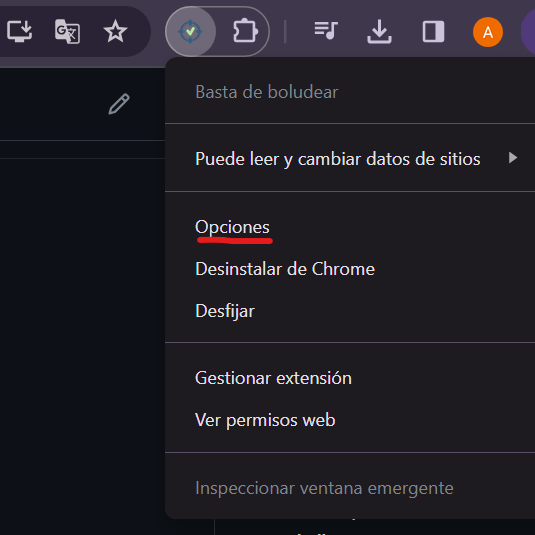
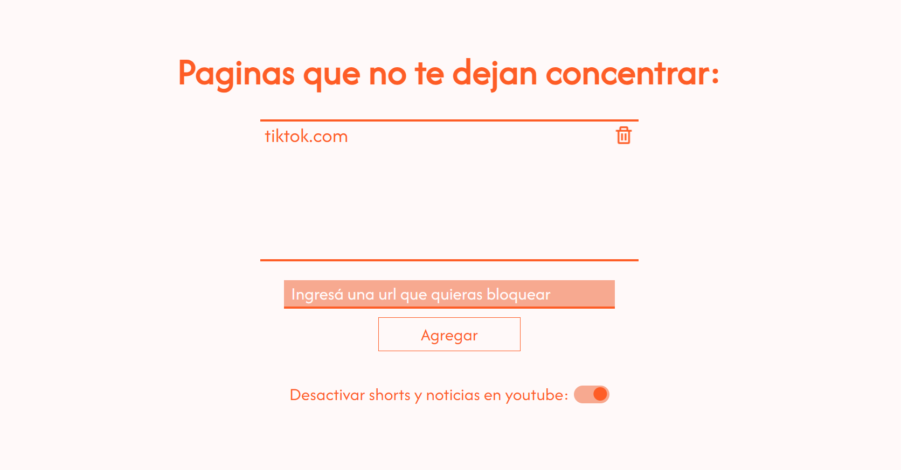
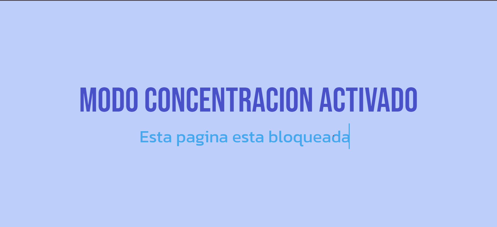

# Extension de Chrome Modo Concentración:

## ¿Para qué sirve?

"Modo Concentración" es una extensión de chrome que permite activar un modo en el que se **bloquean ciertas paginas** que el **usuario haya eligido**, para no distraerse a la hora de trabajar/estudiar en una computadora.

## Instrucciones de instalacion

1. Descargar este repositorio como un archivo [ZIP desde GitHub](https://github.com/agosnd/Extension-Modo-Concentracion/archive/master.zip)
2. Al descomprimir el archivo, deberia tener una carpeta llamada "Extension-Modo-Concentracion-master"
3. En Chrome ir a la pagina de extensiones (chrome://extensions/)
4. Habilitar el modo desarrollador
5. Arrastrar la carpeta "Extension-Modo-Concentracion-master" a cualquier parte de la página para importarla (**NO** elimine la carpeta después)

## ¿Cómo funciona?

- La extension se configura desde la pagina de opciones

- Aqui el usuario debe ingresar el dominio de las urls de las paginas que desea bloquear al activar la extension

- Cuando la extension se encuentra desactivada, el logo que se encuentra arriba a la derecha en nuestro navegador, se verá negro. Para activarla, hay que hacer click en él.

- Finalmente, si la extension esta activada e intentamos entrar a una pagina que hayamos ingresado en la lista, esta se bloqueara y no se podra acceder hasta que la extension se desactive.

